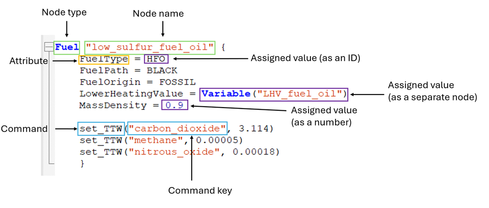

<!--
SPDX-FileCopyrightText: 2026 Fonden Mærsk Mc-Kinney Møller Center for Zero Carbon Shipping
SPDX-License-Identifier: CC-BY-4.0
-->

# Tutorial 1

**Why are you doing this tutorial?**

This tutorial gives you an introduction into how Navigate works, and a walk-through of how to build the necessary input files. This should help you understand the main concepts of Navigate and introduce how to build a Navigate simulation model using assumptions about the fleet, technologies, and fuels.


**How does it work?**

In this document, you have several action points. Mostly, these action points involve writing instructions to define nodes and their attributes, which you do by writing/copying the Navigate instructions from this document into your own working file. 
The input files created in this tutorial reflect the minimum input that you need to get Navigate to run a simulation and receive output. 

## The `tutorial_1.nav` file

In order to run a simulation in Navigate, you always need a "Navigate"-file, i.e. a file with the ending ".nav". One can think of Navigate (built in Python) as the "program/an application" and of a .nav file as the "instructions" that we give to the program.  

Navigate consists of the DEFINE section and the EVENTS section. These two are dependent on each other and can therefore not run individually. As the .nav file are the "instructions" for Navigate, this `tutorial_1.nav` file is the most important file to run our first simulation. Without it, you could not include the define.inc and events.inc files that you will create later.

Open the `tutorial_1.nav` file in your VS Code workspace. 

### Define the DEFINE section

1. Define the DEFINE section.
2. `Include` the input file `define.inc`, which you will create later in this tutorial.
In this file you will define all nodes that will be part of the simulation.
```python
DEFINE {
    Include "./includes/define.inc"
}
```

### Define the EVENTS section

1. Define the EVENTS section.
2. `Include` the input file `events.inc`, which you will create later in this tutorial.
By doing this, the simulation can access the information about the changes to nodes in time.

```python
EVENTS {
    Include "./includes/events.inc"
}
```

#### Commenting

As you continue to work in the file, it will become more complex. Comments can help to structure the document and include explanations. You can write a comment by typing a hashtag (`#`) to mark the beginning of the comment (you can create comments anywhere in the document, also at the end of a line of instructions). You will see that the font color of comments turns to gray.
Comments are not part of the active instructions, i.e. when the file is run, the comments will not be read by the executing application. You can use this by ‘commenting out’ entire sections of instructions, e.g. if you want to see what happens if a certain node or parameter is not included.

 
```python
# This is an example comment
```

## The DEFINE Input File

Now you will build the `define.inc` file that you referred to in your `tutorial_1.nav` file.
Open the `define.inc` file located under `tutorial/include/define.inc`

1. Create a `ModelDefinition` which is a formal requirement for the file.
Define a start date for the model, for which we use `01/01/2025`.
Later, you will define intermediate annual time steps until 2050.

```python
ModelDefinition {
    StartDate = "01/01/2025" 
}
```

### Definition of a Node

You will now learn what a node is. In this example, the node is a fuel node and is called `"low_sulfur_fuel_oil"`. A node consists of attributes to which you can assign values or other relevant assumptions for an overview of a node’s components.



In the instructions, everything within the brackets {} are assignments on the Fuel node `low_sulfur_fuel_oil`. Everything left of an equal sign is an attribute to the specific node. Everything on the right side of an equal sign is the value assigned to the attribute – values can be an ID, a separate node, or a number dependent on the specific attribute being assigned to. If the value of an attribute is another node then that node needs to be defined separately. We e.g., assign a node of the type Variable to the Fuel attribute `LowerHeatingValue`. In the defaults made by Mærsk Mc-Kinney Møller Center for Zero Carbon Shipping, and found in `Navigate/navigate/defaults/installation/*` variables such as the Lower heating value of fuel oil are defined. For simplicity these are not imported in this tutorial modeling, where you will be defining such values yourself. The node `ModelDefinition` you previously defined belongs to a group of unique nodes called General Nodes. Assignment of attributes to these works similar to other nodes but the difference is that general nodes do not have names. This is because only one can be defined per simulation.

**Time to define your first node**

1. Define the node `"fleet"` with the node type `Fleet`. 

```python
Fleet "fleet" {
}
```

Save your edits.

#### Run Navigate for the first time


1. Open a terminal in VS Code
2. Verify that you are in the folder `tutorial_1`
3. Type `navigate tutorial_1.nav`

This should throw the following error message:

```
ValueError: Fleet("fleet"): Attribute 'Vessel' is unassigned.
```

This is because any node of the type Fleet requires a set of attributes, namely the attributes Vessels and the fuel sensitivities (`InterFuelSensitivity` and `IntraFuelSensitivity`). If the model is run while one of these attributes is not defined, there will be an error message notifying you of the missing attribute, as you saw just now. 

Other nodes can also have mandatory attributes. An error message will tell you if these are not defined yet.

If you encounter other errors, read the error message. If it says that a name is not recognized, check for errors in spelling, extra or missing indents or signs by comparing to the code in the tables.

In the next steps, we will define the attributes that are required for a Fleet node.

### Definition of a `Fleet`

We are going to define a vessel node `"vessel_ice_oil"`.

1. As the error message told you, the node Vessel needs to be defined. 
Define Vessel with the node called `"vessel_ice_oil"`.

```python
Vessel "vessel_ice_oil" {
}
```

2. Update `"Fleet"`:
You have already defined the node `"fleet"` with the node type `Fleet`. Insert Vessel with the node called `"vessel_ice_oil"` between the curly brackets of the fleet node definition. 
In this example, you only have one type of vessel which is a "vessel_ice_oil". More vessel types can be included, as long as each of them is defined in the DEFINE section.
"vessel" is in place of the specific vessel type that you will want to simulate. The `"ice"` is an abbreviation for "internal combustion engine", which is the engine type that extract the energy from fuel `"oil"`. The naming is therefore `"vessel type"_"engine type"_"fuel type"`.
This is a naming convention we use but is not required; a node can be named anything.

The `InterFuelSensitivity` and `IntraFuelSensitivity` attributes calibrate the discrete choice model, i.e., the model that predicts what percentage of newbuilds will be of fuel type A or B or C, in combination with engine technology X, Y or Z.

3. The `InterFuelSensitivity` attribute controls how strongly the choice *between fuel types* responds to the levelized cost of transport (LCOT) of each vessel option. Its value is an odds ratio: a value of `0.5` means a fuel whose LCOT is 10% higher receives half the odds of an otherwise identical fuel (lower cost is better, so use a value below `1`).
4. The `IntraFuelSensitivity` attribute does the same for the choice *between engine technologies within a single fuel type* (different engine technologies are for example combustion engines vs. fuel cells). A value of `0.5` likewise means a 10% higher LCOT halves the odds.
5. `InitialVessels` describes the number of vessels present at the defined start date. `InitialVessels` is not a mandatory attribute for the node "fleet" and therefore not necessary to run the model, but necessary if we want an output. 


```python
Fleet "fleet" {	 
    Vessels = [Vessel("vessel_ice_oil")]  
    InterFuelSensitivity = 0.5
    IntraFuelSensitivity = 0.5
    InitialVessels = 100
}
```

### Definition of a `Vessel`

1. Define vessel node `"vessel_ice_oil"`: 
You already defined a Vessel with the node called `"vessel_ice_oil"`.
2. Within the curly brackets of the vessel node definition, now define the attribute `PowerSystem`.
In this example, we will be using a simplified power system that is exclusively powered through low sulfur fuel oil.
Continue to define the other attributes within the curly brackets of the vessel node.
3. Define a Route.
The attribute Route allows input on the route that a reference ship is taking.
4. Set a value for NominalCapacity.
Nominal Capacity describes the amount of cargo or load that the vessel can carry. In this example, our vessel can carry 8000 TEUs, i.e., 8000 containers of a certain size. This is an example value.
5. Define the attribute Tanks.
It allows for input on the characteristics of one or more onboard tanks. The tanks store the fuel onboard the vessel.
6. Set a value for PropulsionLoad.
It describes the propulsion load level at sea, i.e., how much power we need to move the reference vessel `"vessel_ice_oil"`.
LoadLevel's (propulsion, electrical, heat) generally describe power and therefore have the unit MW (mega-watt). It is not a mandatory attribute to run the model, but necessary if we want an output.  We can assign a number, a Curve, or a Surface as the value of the attribute PropulsionLoad.

```python
Vessel "vessel_ice_oil" {
    PowerSystem = PowerSystem("ice_oil")
    Route = Route("route") 	
    NominalCapacity = 8000
    Tanks = [Tank("main_oil")]
    PropulsionLoad = 10
}
```

### Definition of a `PowerSystem`

In the definition of the node `"vessel_ice_oil"`, the attribute, `PowerSystem` has a value, and this value is a separate node `PowerSystem` `"ice_oil"`. In this section, you now need to define the node `"ice_oil"`.
We assume that there are different energy demands on a vessel. There is a propulsion demand, an electrical demand, and a heat demand onboard of any vessel. To meet these demands, the fuel is converted into energy by converters, e.g., by an engine. 

1. Define the node PowerSystem by writing this:
`PowerSystem "ice_oil" { ... }`
It represents the reference vessel’s combination of engines and boilers.
The power system is usually the combination of a main engine, auxiliary engine, and boiler, but can also be configured with a single converter. The main engine is responsible for the propulsion of the vessel, the auxiliary engine is responsible for electrical demand, and the boiler is responsible for the heat demand.
In the next few steps, you will define the node’s attributes. This should be written within the curly brackets `{ }`.
2. Define the engine setup.
3. Define how the `Propulsion` demand is met.
Usually, the propulsion demand is met through the main engine propelling the vessel forward.
4. Define how the `Electrical` demand is met.
The electrical demand is often met through an auxiliary engine, which is mostly a smaller engine separate from the main engine.
5. Define how the Heat demand is met.
The demand is usually met through a boiler.

```python
PowerSystem "ice_oil" {
    Propulsion = Converter("propulsion_ice_oil")
    Electrical = Converter("electrical_ice_oil")
    Heat = Converter("heat_boiler_oil")
}
```

### Definition of a `Converter`

We introduced three new nodes of the type `Converter` in the definition of the node PowerSystem.
Each node needs to be defined by itself.

1. Define the node `"propulsion_ice_oil"` of the node type Converter.
This is the engine that propels the vessel forward.
2. Define the engine’s attribute `PowerCapacity`.
The power capacity of an engine/boiler is the maximum power capacity of the converter in MW. This is equivalent to the horsepower of the engine for a car.
3. Define the `MainFuelTypes` that the vessel can use.
Each converter can use one or more fuel types. In this case, the main engine can only use one fuel type, namely fuel oil (OIL). The main fuel types of the main engine, the auxiliary engine, and the boiler are independent of each other, but depend on the number and type of available fuel tanks.
4. Define `Efficiency`.
Efficiency defines the fraction of chemical energy (e.g., in a fuel) that is converted to kinetic energy (e.g., mechanical).

```python
Converter "propulsion_ice_oil" {
    PowerCapacity = 50
    MainFuelTypes = OIL
    Efficiency = 0.5
}
```

Analogously, define converter nodes for electrical ICE and heat boiler.

5. Define the node `"electrical_ice_oil"` of the node type Converter, e.g. a generator that produces electricity.
Similar to the `"propulsion_ice_oil"`, assign the attributes `PowerCapacity`, `MainFuelTypes`, and `Efficiency` to it.

```python
Converter "electrical_ice_oil" {
    PowerCapacity = 10
    MainFuelTypes = OIL
    Efficiency = 0.5
}
```

6. Define the node `"heat_boiler_oil"` of the node type Converter.
Define and assign the attributes `PowerCapacity`, `MainFuelTypes`, and `Efficiency` as for `"propulsion_ice_oil"`.

```python
Converter "heat_boiler_oil" {
    PowerCapacity = 5
    MainFuelTypes = OIL
    Efficiency = 0.5
}
```

### Definitions of other nodes introduced in `Vessel`

You introduced new nodes when you assigned them as values of the `"vessel_ice_oil"`’s attributes. One of them was the node `PowerSystem` which we defined in the above section.
Others include the definition of a route that the vessel sails, and a definition of a tank node.
The values assigned to the attributes of a Route, namely Ports, Distances, and Speeds are lists which are marked by squared brackets. In this example, the assigned lists only contain one item, respectively.


1. Define the node `"main_oil"` of the node type `Tank`.
You can further specify the characteristics of the tank. For alternative fuels, a vessel can have a main and a pilot tank. 
Set the fuel types that the tank can hold. In this example, the tank can only use OIL, but we can also specify more than one fuel type. Therefore, we specify that the fuel oil tank is the "main" tank in the vessel. 
Set the tank’s `Size`. It is given in cubic meters.

```python
Tank "main_oil" {
    FuelTypes = OIL
    Size = 9000
}
```

2. Define the node `"route"` of the node type `Route`.
Set the `RouteType`. This can be one of two values: `ROUND_TRIP` or `REGIONAL_TRIP`.
Set one or more ports at which a vessel stops. In our example, the vessel is only stopping at one port called `"port"`. In your future Navigate modeling, the port often covers a whole region is specified as Africa, Americas, Asia, Europe and Middle East. Hence, a port is often used as a proxy for a region.
Set the `TimeAtSea`, which defines the proportion of a year that a vessel spends at sea. In our example, the ship is at sea for (0.75*365 days) 273 full days a year.
Set the `ConditionDistribution`, which defines the proportion of the total TimeAtSea, that is spent for each leg of the journey (here: only one leg, i.e. 100% of the total `TimeAtSea` are spent on the leg).
Set the Speeds of the vessel, given in knots, at each leg of the journey (here: only one leg).

```python
Route "route" {
    RouteType = REGIONAL_TRIP 
    Ports = [Port("port")] 
    TimeAtSea = 0.75
    ConditionDistribution = [1.0]
    Speeds = [10]
}
```

#### Run Navigate Again

All mandatory attributes for the nodes under Vessel are now defined. 

Save the file, open the terminal and run the command:

```bash
navigate tutorial_1.nav
```

You should have received the error message below.

```
Port("port") is referenced but not found in either the deck or the default location of Port.
```

Although you have defined all the attributes that are mandatory for the vessel node, you do not yet have enough input to run the model, e.g., the “port” node.

In order to run properly, Navigate is missing information about a port it is traveling to, and information about fuels. You will define these in the next section.

### Definition of a `Port`

1. Define the node `"port"` with the node type `Port`.
Navigate builds on various underlying assumptions. Amongst these assumptions for bunker price and emissions. These are here overwritten for this tutorial. 

```python
Port "port" {	
    set_bunker_price_overwrite("heavy_fuel_oil", 250)
    set_bunker_wtt_overwrite("heavy_fuel_oil", "carbon_dioxide", 0.62)
}
```

2. Run navigate again after saving. `navigate tutorial_1.nav`. You should recieve the following error:

```
Fuel("heavy_fuel_oil") is referenced but not found in either the deck or the default location of Fuel.
```

### Definition of a `Fuel`

Fuels are defined separately from the vessels and the ports.

1. Define the node `"heavy_fuel_oil"` with the node type Fuel.
2. Set the `FuelType`. 
Heavy fuel oil is one of several fuels that has the fuel type OIL.
Different fuels can have the same fuel type, as a fuel essentially is a fuel-pathway (where the pathway describes how it was produced), so e.g., the fuel "blue ammonia" is different from "e-ammonia" due to the way they are produced (their pathway).
In other words, blue and e-ammonia are two different fuels with the same fuel type. 
3. Set `LiquidMarket` to `TRUE`.
This defines that the fuel belongs to a liquid market, meaning that its availability is unconstrained and its price and WTT emissions are the ones assigned on the port.
4. Set the `LowerHeatingValue`.
Each fuel has a lower heating value which is a physical constant, so this value is not changed. The lower heating value describes the heat energy that is being released when the fuel is combusted at a certain temperature. Given in GJ/ton.
5. Set the `MassDensity`.
Each fuel has a mass density which is a physical constant, so this value is not changed. Given in kg/m3.
6. Add the Tank-to-Wake (TTW) emission factors of carbon dioxide, methane and nitrous oxide for the process of converting fuel to energy. 
The `set_ttw(..)` marks a command in the Navigate syntax. Commands are similar to functions in programming languages, and have the syntax `set_xxx(key1, key2, value)`. A command can take 2-3 inputs. In this instance it only has 2 inputs, namely key1 and value.
The unit of an emission factor is ton emissions/ton fuel.

```python
Fuel "heavy_fuel_oil" {	
    FuelType = OIL
    LiquidMarket = TRUE
    
    LowerHeatingValue = 41.2
    MassDensity = 0.9
    
    set_ttw("carbon_dioxide", 3.114)
    set_ttw("methane", 0.00005)
    set_ttw("nitrous_oxide", 0.00018)
}
```

### Definition of `Emission`

1. Define the `Emission` nodes `"carbon_dioxide"`, `"methane"` and `"nitrous_oxide"`

```python
Emission "carbon_dioxide" {
	GlobalWarmingPotential = 1
}

Emission "methane" {
	GlobalWarmingPotential = 25
}

Emission "nitrous_oxide" {
	GlobalWarmingPotential = 273
}
```

### Definition of `Plot`

So far we have defined *what* to simulate. The `Plot` node defines *what output* to produce. Navigate only generates plots when at least one `Plot` node is defined.

1. Define a node `"plots"` with the node type `Plot`.
2. Set the `Directory` attribute to `"./plots/"`. This is the subfolder, relative to the `.nav` file, where the plots are saved. Navigate creates the folder if it does not already exist.
3. Use the `add_plot(...)` command once per plot you want produced. Each takes the label of a plot. For this tutorial we produce the absolute emissions, the global fuel mix, and the bunker price at the port.

```python
Plot "plots" {
    Directory = "./plots/"

    add_plot("global_emission_absolute")
    add_plot("global_fuel_consumed")
    add_plot("port_bunker_price")
}
```

## The EVENTS Input File

1. Open the ‘includes’ folder and within open the `events.inc` file.
2. Define the `Start`.
You will define the End later.

```python
Start
```

3. Because we want Navigate to run simulations until 2050, you need to define intermediate time steps until 2050. In this tutorial we have decided on annual time-steps, but one could also decide on 5-year time-steps or quarterly time-steps, for example.
Define annual time-steps with a reference Date.

```python
Date "01-01-2025"
Date "01-01-2026"
Date "01-01-2027"
Date "01-01-2028"
Date "01-01-2029"
Date "01-01-2030"
Date "01-01-2031"
Date "01-01-2032"
Date "01-01-2033"
Date "01-01-2034"
Date "01-01-2035"
Date "01-01-2036"
Date "01-01-2037"
Date "01-01-2038"
Date "01-01-2039"
Date "01-01-2040"
Date "01-01-2041"
Date "01-01-2042"
Date "01-01-2043"
Date "01-01-2044"
Date "01-01-2045"
Date "01-01-2046"
Date "01-01-2047"
Date "01-01-2048"
Date "01-01-2049"
Date "01-01-2050"
```

4. Mark the end of the timeline with `End`.

```python
End
```

5. Let’s run Navigate and see if it works and we get an output.

Navigate should have run error-free now, with PowerShell showing a message like the one in the right column – well done, you’ve defined all the components necessary to run a simulation!


```
...
Finished EVENTS, elapsed time: 0m and 5s.
```


## Interpret the plots

The `tutorial_1` folder there is a folder called `plots`. Here you can see the output of Navigate. Take a look through it and interpret the results.

## Outlook

Let’s recap. You have created two input files and a Navigate (.nav) program file to run your first Navigate simulation: 
- `define.inc` file: This file includes nodes that access the navigate program. This file includes all the variables you want to investigate with your simulation.
- `events.inc` file: This file contains the timesteps that you want your simulation to take.

Together, the input from these three files allowed you to run a simulation in Navigate, and produce plots to compare e.g., global fuel demand and global emissions in different scenarios.

However, this minimalistic version of a Navigate model is of course extremely simplified so not particularly useful to make predictions. In most real-world fleets/scenarios, there are for example more than one vessel, more than one fuel, and a multitude of different routes that vessels take. 

That is why in the next tutorial, you will add some complexity to the files you have already worked on - for example, adding more fuels and more vessels, so you can experiment with the output you receive and understand the principles of the Navigate analysis in more depth.
